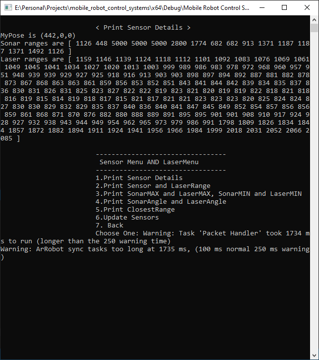

# Mobile Robot Control System

## Prerequisites 

This application requires some background work before running. The project is built in a Visual Studio Environment 
with C & C++ installed. A MobileSim Robot simulator software needs to be installed as well. 
MobileSim can be found here [`MobileSim-0.7.5.exe`](Map/). 

## About

The Mobile Robot Control System is C/C++ Console Application that controls the movement of a Robot in a simulation environment. It 
basically serves as the Robot controller. The MobileSim(The simulation environment) is connected to the Console Application via the Aria 
API and Libraries. The Console Application has classes and methods that help to facilitate the simulation process.
To run the application successfully, the MobileSim software needs to be opened. The simulator map can then be loaded to the MobileSim.
The simulator map can be found here [`office.map`](Map/). 

## App Features 

### MobileSim Software & Map

This software & map serves as a simulation environment for the robot. 
The map is connected to the console application which serves as the controller.

### Main Console Menu 

### Connection

This menu connects the Console Application and the MobileSim using the [`PioneerRobotAPI`](API/PioneerRobotAPI.h) 

When Robot is connected ...

### Robot's Motion 

 

### Robot's Turning - Left/Right/Rotation

 

### Robot's Sensors 

 

### Robot's Position

 

## Technologies

  
  
  
  

## Contributors 

1. Muhammed Suwaneh, Eskişehir Osmangazi University, Eskişehir, Turkey.
2. Yakupcan Ergen, Eskişehir Osmangazi University, Eskişehir, Turkey.
3. Kadirhan Kubat, Eskişehir Osmangazi University, Eskişehir, Turkey.
4. Alperen Bişkin, Eskişehir Osmangazi University, Eskişehir, Turkey.

## Project Supervisor 

Dr. Metin Özkan, Professor & Lecturer @Eskişehir Osmangazi University, Eskişehir, Turkey.

### The Project is license under [`MIT`](LICENSE) Copyright 2020-21

